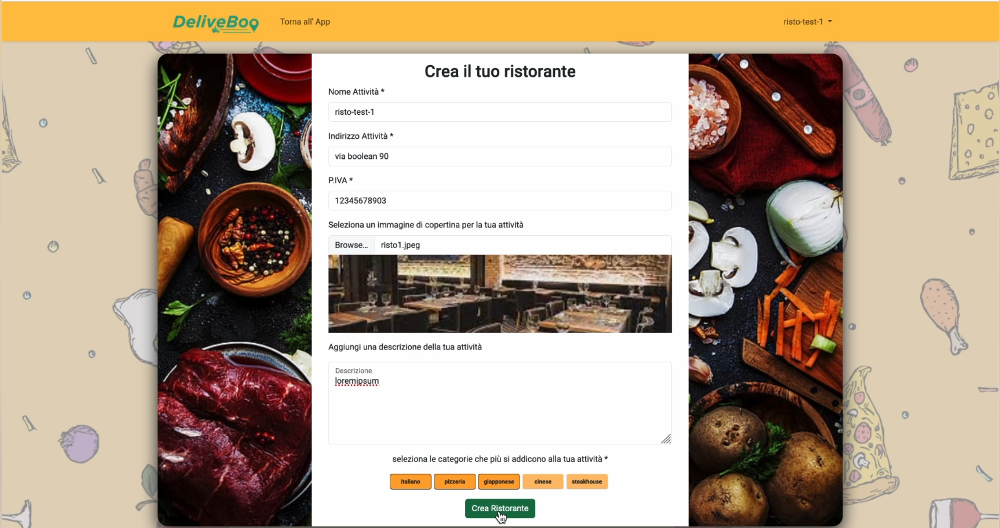
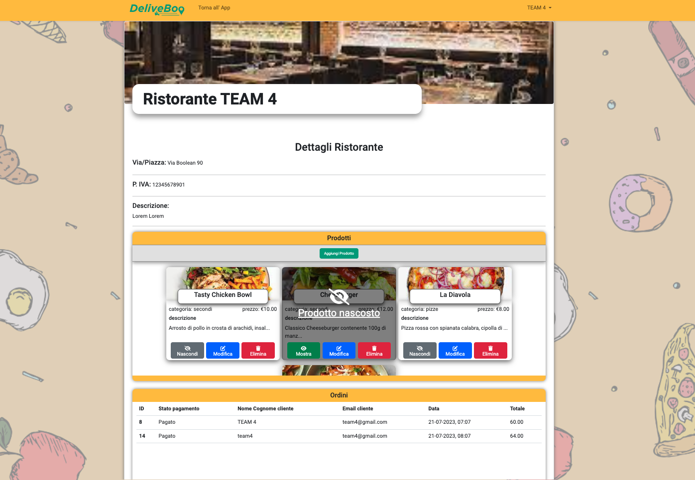
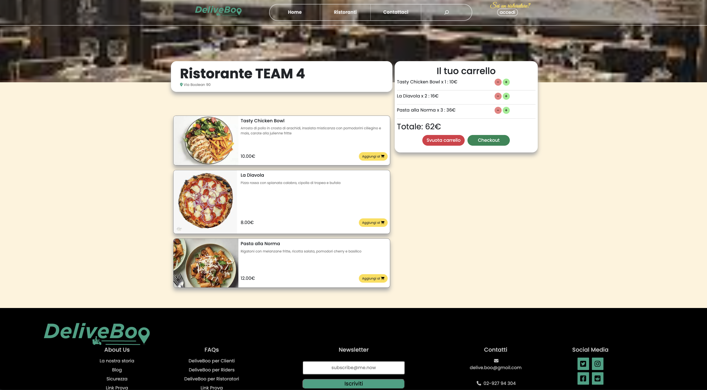
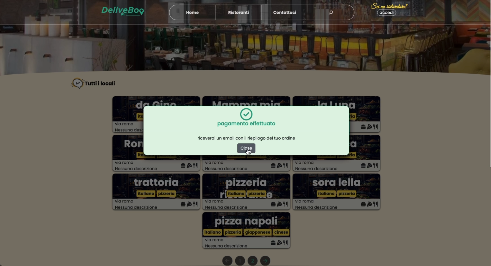

# 

DeliveBoo is a food delivery webApp that allows Restaurant owners to register, create a restaurant and insert, edit, delete and eventually display (or not) a product. Once their shop is up and running, a customer from the other end, will be able to see it without the need of a registration. From this platform, they can therefore select a shop, eventually build up a cart and finally move to the checkout page, where they will insert their name, email address, shipping address and card details. Lastly, a confirmation will be shown to both the client and the user.

## Screens

 

Restaurant Dashboard

    
        
    
    
        
    
        
        
    

  

Customer Side

    
        
    
    
        
    
        
        
    

